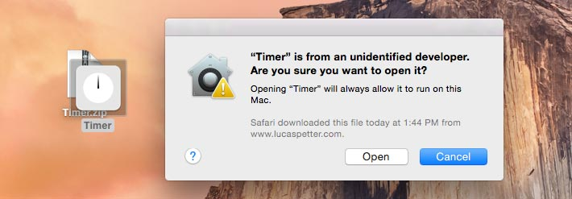

# Timer

A countdown timer for the Mac OS X Dashboard.

[Download](https://github.com/lucaspetter/timer/releases/latest)

## About Timer

Timer is a widget for the Mac OS X Dashboard for alerting after a set amount of time has passed. Just type an amount of time, click Start, and it will begin counting down. When it reaches zero, a sound will play and a notification message will appear in the top-right corner of your screen.
Settings on back side of Timer

## Options

Hover your mouse pointer over Timer and click the small "i" to flip to the back side, where you can change various settings.
- Choose the alert sound that plays when the timer finishes. Available sounds are: Harmony, Reveal, Rooster Crow, Tibetan Bowl, TV Tone, or silence.
- Prevent the computer from sleeping until the timer has finished.
- A Notification Center message will appear when the timer finishes. (Mac OS X 10.8 or later)
- Timer can briefly raise the system audio volume level while the alert sound plays, then return it to its previous level. (This is an experimental feature, do not enable it while wearing earphones!)
- Timer will automatically check for updates to its software.

## Installation

1. If you're running Mac OS X 10.10 Yosemite or later, you may need to turn on Dashboard if it isn't on already. (On Mac OS X 10.9 Mavericks and earlier, the Dashboard is always on.)
2. Download Timer.zip, then find it on your hard drive and double-click it to open it.

3. Right-click on the Timer widget icon and select "Open" in the menu. (If you don't have a right mouse button, hold the "control" key on the keyboard then click the icon.)

4. Click the "Open" button to confirm that you want to install Timer.

## Requirements

Timer works on Mac OS X 10.5 Leopard through 10.10 Yosemite.

Mac OS X 10.8 Mountain Lion or later is required for notification messages to be displayed.

## Known issues
- With the "Raise system volume" setting enabled, the volume will only be raised if the current volume is less than 75%; levels higher than 75% aren't raised further.
- On Mac OS X 10.5 and 10.6, textbox placeholders are aligned left instead of centered.

## Contributing
Anyone is welcome to help build this program. Together, we can make it even better. You can help by:
- Reporting issues.
- Submitting code changes or fixes in a new pull request.
- Telling your friends about this program and/or sharing it with them.

By submitting changes, you agree to licence your work under the [GNU General Public License](https://www.gnu.org/licenses/gpl.html), version 3 or later.

## Licence
Timer is Copyright © 2015 [Lucas Bleackley Petter](https://www.lucaspetter.com/).

Timer is free software: you can redistribute it and/or modify it under the terms of the [GNU General Public License](https://www.gnu.org/licenses/gpl.html) as published by the Free Software Foundation, either version 3 of the License, or (at your option) any later version.

Timer is distributed in the hope that it will be useful, but WITHOUT ANY WARRANTY; without even the implied warranty of MERCHANTABILITY or FITNESS FOR A PARTICULAR PURPOSE. See the GNU General Public License for more details.

### Software binaries used in Timer

[terminal-notifier](https://github.com/julienXX/terminal-notifier) is copyright © 2015 Eloy Durán and Julien Blanchard, licenced under the [MIT License](https://github.com/julienXX/terminal-notifier).